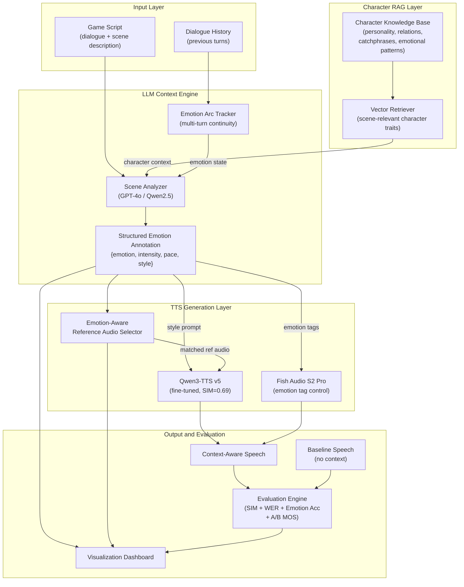

# Context-Aware Emotional TTS for Game AI Dubbing

## 1. 项目核心思路

已有基础：Qwen3-TTS 微调后 SIM_gt=0.69（音色还原优秀），RTF=0.36（实时推理）。
**现存问题：** 模型只学会了"像谁在说话"，没学会"在什么场景下怎么说话"——缺乏游戏情境下的情感表达。
**解决方案：** 在 TTS 前面加一层 **LLM Context Engine**，结合角色知识库（RAG）和多轮情感弧线追踪，分析游戏剧本上下文，生成情感/韵律控制信号，引导 TTS 输出更符合场景的语音。

---

## 2. 系统架构总览



---

## 3. 核心功能模块

### 3.1 LLM Context Engine（核心创新）

用 LLM 分析游戏对白的上下文，输出结构化情感标注：

```json
{
  "text": "慌什么，肩上的伤早就愈合了，听我的声音，这不是好得很",
  "scene": "战斗结束后，秦彻受伤但安慰女主",
  "emotion": "gentle_reassuring",
  "intensity": 0.6,
  "pace": "slow",
  "style": "温柔、带有轻微疲惫但故作轻松",
  "ref_emotion_category": "tender",
  "emotion_arc_position": "climax_to_resolution"
}
```

- 使用 GPT-4o / Claude / Qwen2.5 作为 Context Engine
- 输入：当前台词 + 前后文 + 场景描述 + RAG 检索到的角色特征
- 输出：情感标签、语速、强度、风格描述、参考音频情感类别、弧线位置
- Few-shot prompt 设计是关键，需要覆盖乙女游戏的典型情感场景

### 3.2 角色知识库 (Character RAG)

构建秦彻的结构化人设知识库，通过 RAG 注入 LLM 上下文：

- **基础人设：** 性格特征（外冷内热、保护欲强）、身份背景、口头禅
- **角色关系：** 与女主的关系发展阶段（初识→信任→亲密），与其他角色的互动模式
- **情感模式库：** 秦彻在不同场景下的典型情感反应模式（战斗时冷静果断、日常互动时偶尔调侃、关心时故作轻松）
- **实现方式：** 文档 → embedding → 向量数据库（FAISS/ChromaDB），LLM prompt 中注入 top-k 检索结果

### 3.3 多轮对话情感弧线追踪

不只看单句台词，而是追踪对话流中的情感弧线：

- **Sliding Window：** 维护最近 5-10 轮对话的情感状态
- **Emotion State Machine：** 追踪情感变化趋势（紧张→释然→温柔），确保生成语音的情感过渡自然
- **弧线约束：** 防止相邻台词情感跳跃过大（如上一句"愤怒"下一句突然"撒娇"）
- LLM 在生成当前台词的情感标注时，会同时接收到前几轮的情感标注作为上下文

### 3.4 情感感知的 Reference Audio 选择

将训练数据按情感分类（LLM 辅助标注），推理时根据场景选择情感匹配的参考音频：

- **情感分类体系：** tender（温柔）、calm（沉稳日常）、playful（调侃轻松）、intense（战斗紧张）、cold（冷酷威严）、intimate（亲密低语）
- 对 664 条训练音频 + 5 条参考音频全部标注情感类别
- 推理时 LLM 输出的 `ref_emotion_category` 直接索引到最匹配的参考音频
- 参考音频直接影响 Qwen3-TTS 的 speaker embedding 和说话风格

### 3.5 Fish Audio 情感标签对比路径

Fish Audio S2 Pro 支持 `[tag]` 内联情感控制（15000+ 标签），作为对比方案：

- LLM 输出的 emotion → 映射为 Fish Audio tag（如 `[温柔]`、`[紧张]`、`[调侃]`）
- 无需参考音频选择，直接在文本中嵌入 tag
- 用于验证"LLM Context Engine"的通用性（不绑定单一 TTS 引擎）

### 3.6 可视化 Dashboard

在前端（已有 React 基础 on `master` branch）增加：

- **场景输入面板：** 输入游戏对白 + 场景描述
- **LLM 分析可视化：** 实时显示 RAG 检索结果、情感标注输出、弧线状态
- **参考音频可视化：** 显示被选中的参考音频波形 + 情感标签
- **对比试听：** 并排播放 baseline（无 context）vs context-aware 生成的语音
- **评估指标面板：** 实时显示 SIM、WER、Emotion Accuracy

---

## 4. 评估体系

### 4.1 三组对比实验设计

| 实验组 | 描述 | 目的 |
|--------|------|------|
| **(a) No-Context Baseline** | 纯 TTS 生成，固定参考音频，无情感控制 | 基线，证明"flat"问题存在 |
| **(b) Manual-Emotion** | 人工为每句台词标注情感，手动选择参考音频 | 上界，证明情感控制有效 |
| **(c) LLM-Context (Ours)** | LLM 自动分析上下文 + RAG + 情感弧线 | 核心方案，证明自动化接近人工 |

### 4.2 指标体系

- **音色保持：** SIM_gt（生成 vs 真实音频余弦相似度），目标 > 0.68
- **文本准确性：** WER（ASR 转写字错率），目标 < 0.10
- **情感准确率（新增）：** 用独立 emotion classifier 判断生成语音情感 vs LLM 标注情感的一致率
- **主观评估：** A/B preference test（10+ 评估者），MOS 5分制
- **业务指标：** 单句生成时间、API 调用成本、与人工配音成本对比

---

## 5. 竞争对手分析

- **ElevenLabs / Azure TTS：** 业界领先的语音克隆服务，音质优秀，但只做音色层面的克隆，无场景级情感理解能力。用户如需情感变化，必须自己调参数或录制不同情感的参考音频。
- **Fish Audio WebUI：** 支持 `[tag]` 内联情感控制（15000+ 标签），技术上最接近我们的方案，但需要用户为每一句台词手动标注 emotion tag，无法自动理解剧本上下文。大规模配音时人工成本仍然很高。
- **CosyVoice / GPT-SoVITS：** 开源社区方案，擅长零样本或少样本语音克隆，但完全没有 LLM 驱动的上下文理解层。用户需要自己准备不同情感的参考音频并手动切换。
- **Seed-TTS (ByteDance)：** 字节跳动的研究型 TTS，支持 emotion/style control，但闭源且不面向游戏场景，无法定制化角色知识库。

**本项目的独特性：** LLM + RAG + 情感弧线追踪 + TTS 的端到端闭环。自动从游戏剧本中理解上下文、检索角色人设、追踪情感变化，驱动语音生成——无需人工标注每一句台词的情感。这是一个**"AI 情感导演"**而不是一个单纯的 TTS 工具。

---

## 6. 商业价值分析

### 6.1 目标市场

- **主要市场：** 中国乙女游戏 / 恋爱游戏工作室（光与夜之恋、恋与深空、未定事件簿等同类产品）
- **扩展市场：** 一般剧情类手游（RPG、AVG）、有声小说/广播剧制作、短视频/直播虚拟人
- **远期市场：** 全球游戏本地化（多语言 AI 配音）

### 6.2 市场规模与痛点

- 中国游戏市场 2025 年规模约 3000 亿元，其中乙女/女性向游戏约 200-300 亿
- **核心痛点：** 乙女游戏对配音质量要求极高（角色魅力 = 声音魅力），但配音成本占制作成本 10-15%
  - 一线配音演员档期紧张，录制周期长（一部游戏主线配音 3-6 个月）
  - 剧本迭代时需要重新录制，时间成本极高
  - DLC/活动更新频繁，持续产生配音需求
  - 小工作室预算有限，难以承担一线配音演员费用

### 6.3 商业模式

- **SaaS 平台（B2B）：** 面向游戏工作室提供 API 服务
  - 按生成音频时长计费（如 0.1 元/秒）
  - 包月套餐：小型工作室 2000 元/月（100小时），中型 8000 元/月（500小时）
  - 角色定制费：单角色语音克隆 + 知识库搭建 5000-10000 元一次性
- **本地部署方案（Enterprise）：** 面向大型游戏公司（如腾讯、网易、米哈游）
  - 一次性授权 + 年度维护费
  - 数据安全保证（配音素材不出公司）

### 6.4 成本对比

- **人工配音：** 一线配音演员 1000-3000 元/小时，一部游戏主线约 50-100 小时 = 5-30 万元
- **AI 配音（本方案）：** GPU 推理成本约 0.02 元/秒（A100 按需），一部游戏主线 50 小时 ≈ 3600 元 = **成本降低 98%**
- **时间对比：** 人工录制 3-6 个月 vs AI 生成 1-2 天（含审核）

### 6.5 竞争壁垒

- **技术壁垒：** LLM Context Engine 的 prompt engineering know-how + 角色知识库构建方法论
- **数据壁垒：** 随着合作游戏增多，积累的角色知识库和情感标注数据形成护城河
- **先发优势：** 目前市场上无同类"LLM + 情感上下文 + TTS"的端到端方案

---

## 7. 时间线与交付物

### Phase 1: Proposal（3月27日）

- 撰写 200-400 词 proposal PDF
- 包含团队信息 + Problem Statement + Objective + Competitors + Proposed Solution + Business Value

### Phase 2: Milestone（4月17日，共 3 周）

**Week 1（3.28 - 4.3）：**

- 构建秦彻角色知识库（收集游戏 wiki、剧情摘要、角色分析），向量化存储
- 设计 LLM Context Engine 的 few-shot prompt（覆盖 6 种情感类别的典型场景）
- 用 LLM 对 664 条训练音频进行情感标注分类

**Week 2（4.4 - 4.10）：**

- 搭建基础 pipeline：script → RAG 检索 → LLM 分析 → 参考音频选择 → TTS 生成
- 实现情感弧线追踪模块（sliding window + state tracking）
- 初步跑通 10 条游戏台词的端到端生成

**Week 3（4.11 - 4.17）：**

- 整理 2-4 张应用截图（pipeline 流程、生成对比、Dashboard 原型）
- 撰写 2-3 页 milestone report
- 记录已完成工作 + 剩余任务 + 技术挑战

### Phase 3: Final（5月10日，共 3.5 周）

**Week 4-5（4.18 - 5.1）：**

- 完善前端 Demo（场景输入、情感可视化、对比试听）
- 完成三组对比评估实验（no-context / manual / LLM-context）
- 完成主观 A/B preference test（组织 10+ 评估者）

**Week 6（5.2 - 5.10）：**

- 撰写 4-6 页 final report
- 制作 3 分钟演示视频
- 整理源码并提交（GitHub link）

---

## Appendix A: 技术可行性分析

### A.1 LLM Context Engine — 可行性：高

**已验证的技术基础：**

- GPT-4o / Claude / Qwen2.5 对中文游戏剧本的理解能力已经非常成熟
- 结构化 JSON 输出（function calling / structured output）是成熟功能
- Few-shot prompt 在情感分类任务上准确率通常 > 85%

**落实方案：**

- 使用 OpenAI API（GPT-4o）或本地部署 Qwen2.5-72B（A100 集群已有）
- Prompt 设计：system prompt 定义角色 + 情感分类体系，user prompt 输入台词 + 场景 + RAG 上下文
- 输出格式：JSON schema 约束，确保 emotion/intensity/pace/style 字段完整
- 成本：GPT-4o 约 $0.005/句（每句 ~500 tokens input + 200 tokens output）；本地 Qwen 则近乎免费

**风险与缓解：**

- 风险：LLM 对特定角色的情感理解可能不够细腻 → 缓解：通过 RAG 注入角色知识库
- 风险：情感分类粒度不够 → 缓解：从 6 类开始，根据实验结果决定是否细化

### A.2 角色知识库 RAG — 可行性：高

**已验证的技术基础：**

- RAG 是 2024-2025 最成熟的 LLM 增强技术之一
- FAISS / ChromaDB 等向量数据库开箱即用
- 秦彻（光与夜之恋/恋与深空角色）在网上有大量 wiki、角色分析、剧情摘要

**落实方案：**

1. 数据收集：从游戏 wiki、百度百科、NGA 论坛、B站角色分析帖收集秦彻人设材料（约 5000-10000 字）
2. 结构化整理：分为 personality、relationships、emotional_patterns、catchphrases 四个维度
3. 向量化：使用 text-embedding-3-small 或 bge-large-zh 生成 embedding
4. 存储：ChromaDB（轻量，适合 demo）或 FAISS（性能更好）
5. 检索：每次 LLM 调用前，用"当前场景描述"检索 top-3 相关角色特征片段，注入 prompt

**预期效果：** 确保 LLM 不会输出"秦彻撒娇"这种不符合角色设定的情感判断

### A.3 情感弧线追踪 — 可行性：中高

**技术方案：**

- 维护一个 sliding window（最近 5-10 轮对话），每轮记录 `{text, emotion, intensity}`
- 将历史情感序列作为 LLM 的额外上下文输入
- 可选：定义简单的情感过渡规则（如 `intense → calm` 是自然的，`intense → intimate` 需要过渡）

**落实方案：**

- 简单版（Milestone）：将历史情感标注直接拼接到 LLM prompt 中
- 进阶版（Final）：实现 emotion state machine，LLM 输出 + 规则约束结合

**风险与缓解：**

- 风险：游戏对话不一定是连续的（可能有选择支、分支剧情）→ 缓解：支持手动重置情感状态
- 风险：弧线约束过强导致僵化 → 缓解：约束作为 soft guidance 而非硬限制

### A.4 情感参考音频选择 — 可行性：高

**技术方案：**

- 对 664 条训练音频，用 LLM 分析对应文本的情感（无需听音频，从台词文本即可判断）
- 建立 6 类情感 bucket（tender/calm/playful/intense/cold/intimate）
- 每类选 3-5 条高质量音频作为候选参考音频
- 推理时根据 LLM 输出的 `ref_emotion_category` 从对应 bucket 中随机选择

**已有基础：** 训练数据已有 `train_manifest.jsonl` 包含文本标注，可以直接用 LLM 批量标注情感

**关键假设验证：** Qwen3-TTS 的参考音频确实影响生成风格（已有经验：不同 ref audio 确实导致生成语音的语气差异）

### A.5 前端可视化 Dashboard — 可行性：高

**已有基础：**

- `master` 分支已有 React + TypeScript + Vite 前端项目
- 已有 Dashboard.tsx（27.2KB）、LandingPage.tsx、DemoPage.tsx 等组件
- 已部署到 Cloudflare（`cloudflare/workers-autoconfig` 分支）

**落实方案：**

- 在 DemoPage 中新增"场景配音"模式：输入台词 + 场景描述 → 显示 LLM 分析结果 → 播放生成音频
- 新增可视化组件：情感标注卡片、参考音频波形、情感弧线图表（用 recharts/d3）
- 后端 API：可以用 Cloudflare Workers 做 proxy，转发到 GPU 服务器的推理 API

### A.6 评估体系 — 可行性：高

**客观评估（全自动）：**

- SIM_gt / SIM_ref：复用已有的 pyannote embedding 余弦相似度（代码在 `scripts/eval_finetuned.py`）
- WER：复用 WhisperX ASR 转写 + jiwer 计算（代码已有）
- Emotion Accuracy：使用独立 emotion classifier（如 emotion2vec 或 SER 模型）判断生成语音的情感类别

**主观评估：**

- A/B preference test：4 人小组 + 邀请 6-10 位同学参与
- 每组 20 句对比（baseline vs context-aware），评估者选择偏好
- MOS 5 分制：自然度、情感适当性、角色匹配度三个维度

---

## Appendix B: 技术栈与依赖

- **LLM API：** OpenAI GPT-4o / Anthropic Claude 3.5 / 本地 Qwen2.5-72B
- **RAG：** ChromaDB + bge-large-zh embedding
- **TTS 主引擎：** Qwen3-TTS 1.7B (fine-tuned v5) + FasterQwen3TTS (CUDA Graph)
- **TTS 对比引擎：** Fish Audio S2 Pro (emotion tag)
- **前端：** React + TypeScript + Vite + Recharts (可视化)
- **后端/部署：** Cloudflare Workers (前端) + A100 GPU 服务器 (TTS 推理)
- **评估工具：** pyannote.audio (SIM), WhisperX (ASR), jiwer (WER), emotion2vec (SER)
- **向量存储：** ChromaDB / FAISS
- **语言：** Python (后端/ML), TypeScript (前端)
